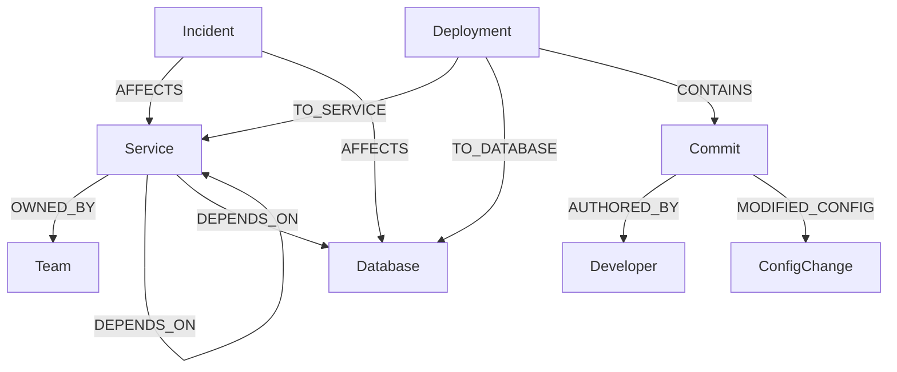

# Graph Detective 🔍
### *"Trace the chain. Find the root cause."*

Graph Detective is a production incident investigation and dependency analysis platform built to demonstrate the power of graph data modeling using **CognoDB** and **openCypher**. 

In modern microservice architectures, resolving a production incident requires connecting the dots across disparate layers: active alerts, service dependencies, recent deployments, git commits, configuration changes, and team ownership. This application models these components as a connected graph, allowing on-call engineers to trace root causes and map downstream blast radius in milliseconds.

---

## 🚀 Live Demo & Demo Video
* **Hosted Frontend (Vercel):** [https://graph-detactive.vercel.app/](https://graph-detactive.vercel.app/)
* **Hosted Backend (Render):** [https://graphdetactive.onrender.com](https://graphdetactive.onrender.com)
* **Demo Walkthrough Video:** *(Insert your screen recording link here)*

---

## ❓ Why a Graph Database? (vs Relational PostgreSQL)

When answering questions about **connections** and **transitive dependencies**, relational databases struggle. Below are the two primary reasons why Graph Detective is built on CognoDB instead of a relational model:

### 1. Downstream Blast Radius (Variable-Depth Transitive Dependencies)
To determine the impact of a database (e.g., `Cart-Redis`) failing, we need to trace all services that depend on it directly or transitively (up to 5 hops deep).
* **In SQL (PostgreSQL):**
  This requires a **Recursive Common Table Expression (CTE)** that self-joins a `service_dependencies` table. The query is verbose, hard to maintain, and suffers from performance degradation because of index-lookup index joins at each recursion level:
  ```sql
  WITH RECURSIVE blast_radius AS (
      SELECT service_id, depends_on_id FROM service_dependencies WHERE depends_on_id = 'Cart-Redis'
      UNION ALL
      SELECT sd.service_id, sd.depends_on_id FROM service_dependencies sd
      INNER JOIN blast_radius br ON sd.depends_on_id = br.service_id
  )
  SELECT * FROM blast_radius;
  ```
* **In openCypher (CognoDB):**
  Thanks to **index-free adjacency**, CognoDB traverses pointers directly between memory nodes, resulting in a clean, O(1)-per-hop query:
  ```cypher
  MATCH (downstream:Service)-[:DEPENDS_ON*1..5]->(target {id: 'Cart-Redis'})
  RETURN downstream
  ```

### 2. Root Cause Tracing (Heterogeneous Multi-Hop Traversal)
Finding the root cause of an incident requires joining multiple distinct entity types: `Incident -> Service -> Deployment -> Commit -> ConfigChange -> Developer`.
* **In SQL:**
  This requires joining 6 separate tables (`incidents`, `services`, `deployments`, `commits`, `config_changes`, `developers`) with multi-key filters. If we decide to add a new intermediate node (e.g., `PullRequest` or `JiraTicket`), we must alter multiple schemas and rewrite the entire query structure.
* **In openCypher:**
  The schema is flexible. The query maps directly to our visual mental model:
  ```cypher
  MATCH path = (i:Incident {id: $incidentId})-[:AFFECTS]->(s:Service)
                <-[:TO_SERVICE]-(d:Deployment)-[:CONTAINS]->(c:Commit)
                -[:MODIFIED_CONFIG]->(cc:ConfigChange)
  RETURN path
  ```

---

## 🛠 Architecture & Tech Stack
```
┌─────────────────┐       ┌─────────────────┐       ┌─────────────────┐       ┌──────────────┐
│  Next.js App    │ ───>  │  Go (Gin) API   │ ───>  │  Neo4j Go       │ ───>  │   CognoDB    │
│  (React Flow)   │       │  Server         │       │  Driver (Bolt)  │       │  (Cloud DB)  │
└─────────────────┘       └─────────────────┘       └─────────────────┘       └──────────────┘
```
* **Frontend:** Next.js 15, React, TypeScript, TailwindCSS, and **React Flow** (custom styled SVG node components).
* **Backend:** Go 1.20+, Gin Web Framework (modular architecture with config, handler, repository, and seeder layers).
* **Database:** CognoDB Cloud (free c0 tier instance using openCypher over Bolt protocol).

---

## 📊 Graph Data Model

### Schema Diagram (Mermaid)


### Nodes Description
* **`Incident`**: `{ id, title, severity, status, description, createdAt }`
* **`Service`**: `{ id, name, type, language, status }`
* **`Database`**: `{ id, name, type, status }`
* **`Deployment`**: `{ id, version, env, deployedAt, status }`
* **`Commit`**: `{ id, hash, message, author, committedAt }`
* **`ConfigChange`**: `{ id, key, oldValue, newValue }`
* **`Team`**: `{ id, name, slackChannel }`

---

## 💡 Example Scenario Walkthrough (Incident 1)

To see Graph Detective in action, consider **Incident 1 (Checkout Failures)**, populated by our seed script. Here is how an SRE uses the platform to isolate the issue:

1. **The Alert:** The SRE opens the dashboard and selects **Order Checkout Failures (HTTP 500)**.
2. **Root Cause Analysis:** Clicking **Trace Root Cause** triggers the `shortestPath` query. The UI renders the following causal graph path:
   `Incident (inc-101) -> Service (OrderService) -> Service (PaymentService) <- Deployment (dep-992) -> Commit (com-442) -> ConfigChange (cfg-101)`
3. **The Culprit Identified:** By clicking on the **ConfigChange** node, the SRE views the properties panel:
   * **Key:** `payment_timeout_ms`
   * **Old Value:** `5000`
   * **New Value:** `50`
   * **Commit Message:** *"refactor(payment): lower timeout for faster client failover"*
   * **Author:** `Sarah Jenkins` (`sarah@novacart.io`)
   * SRE immediately contacts Sarah to rollback the configuration timeout change.
4. **Blast Radius Mapping:** Next, the SRE selects `OrderService` and clicks **Analyze Blast Radius**. The graph displays:
   `gateway -> order-service`
   This reveals that the public **Gateway** depends on `OrderService`, meaning checkout errors are affecting all incoming client requests on the gateway route.

---

## 📝 Main Cypher Queries Explained

### 1. Root Cause Path Analysis (Graph-Native shortestPath)
Finds the causal chain showing how an incident is connected to suspicious configuration updates through deployments and commits within a 6-hop depth limit:
```cypher
MATCH (i:Incident {id: $incidentId})
MATCH path = shortestPath((i)-[*..6]-(cc:ConfigChange))
RETURN path
```

### 2. Transitive Downstream Blast Radius (Variable Depth)
Traverses the dependency tree up to 5 levels deep in reverse to identify all downstream services and teams impacted by an outage:
```cypher
MATCH path = (downstream:Service)-[:DEPENDS_ON*1..5]->(target {id: $componentId})
RETURN path
```

### 3. Bidirectional 1-Hop Topology Map
Displays immediate upstream dependencies (things the service depends on) and downstream dependencies (things depending on the service):
```cypher
MATCH (s {id: $serviceId})
OPTIONAL MATCH (s)-[r1:DEPENDS_ON]->(u)
OPTIONAL MATCH (d)-[r2:DEPENDS_ON]->(s)
RETURN s, collect(distinct u) as upstreams, collect(distinct r1) as r1s, collect(distinct d) as downstreams, collect(distinct r2) as r2s
```

---

## ⚙️ Environment Variables

### Backend (`backend/.env`)
Create a `.env` file inside the `backend` folder:
```env
PORT=8080
COGNO_DB_URI=bolt+s://<instance-id>.databases.cognodb.cloud
COGNO_DB_PASSWORD=<your-generated-password>
CORS_ALLOWED_ORIGINS=http://localhost:3000
```

### Frontend (`frontend/.env.local`)
Create a `.env.local` file inside the `frontend` folder:
```env
NEXT_PUBLIC_API_URL=http://localhost:8080
```

---

## 💻 Local Setup & Run Instructions

### 1. Provision CognoDB Cloud
1. Go to [console.cognodb.com](https://console.cognodb.com) and create a free account.
2. Create a free (c0) instance and note the Bolt connection URI and generated password.
3. Configure these inside your `backend/.env` file.

### 2. Run the Seed Data Script
Initialize the mock environment ("NovaCart") scenarios in the database:
```bash
cd backend
go run cmd/seed/main.go
```
*Verification: You will see console logs executing 30+ node creation queries.*

### 3. Start the Go Backend API
```bash
cd backend
go run cmd/api/main.go
```
*Verification: Serves API endpoints on port 8080. Returns health check via `curl http://localhost:8080/api/status`.*

### 4. Start the Next.js Frontend
```bash
cd frontend
npm install
npm run dev
```
*Verification: Open `http://localhost:3000` in your browser to explore the dashboard.*

---

## 🛡 Graceful Error & Offline Handling
If CognoDB becomes unreachable or is not yet configured:
* The Go backend **will not crash**. It logs a connection warning and starts the API server.
* The API status returns `{ "database": "disconnected" }`.
* The Next.js frontend detects this state and renders a prominent status warning banner: *"CognoDB: Offline. Please configure credentials."*
* Every graph query checks database connectivity and returns a clean `503 Service Unavailable` error instead of throwing raw database exceptions.
